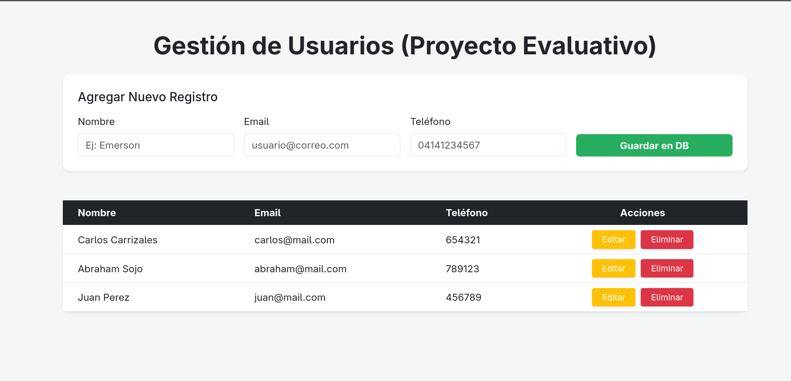

Proyecto de Gestión de Usuarios - Node.js & MongoDB

Este proyecto es una aplicación web desarrollada para la evaluación de la plataforma **Unetieduca**. Consiste en un sistema de gestión que permite realizar operaciones CRUD (Crear, Leer, Actualizar y Borrar) sobre una base de datos NoSQL, integrando validaciones de datos específicas para el contexto venezolano.

## 👥 Integrantes del Grupo
* **Emerson Tarazona**
* **Carlos Carrizales**
* **Abraham Sojo**

---

## 🚀 Tecnologías Utilizadas
* **Backend:** Node.js y Express.
* **Base de Datos:** MongoDB (Atlas/Local) con Mongoose.
* **Motor de Plantillas:** EJS (Embedded JavaScript).
* **Estilos:** Bootstrap 5.
* **Variables de Entorno:** Dotenv.

---

## 📋 Requisitos del Proyecto (Cumplidos)
- [x] **Mínimo 5 colecciones:** Users, Products, Categories, Suppliers y Orders.
- [x] **Mínimo 4 campos por colección:** Esquemas definidos con validaciones de tipo y obligatoriedad.
- [x] **Módulo CRUD:** Implementación completa de Create, Read, Update y Delete.
- [x] **Consulta Sencilla:** Implementada mediante el método `.find()` para renderizar la tabla principal.
- [x] **Interfaz de Usuario:** Panel dinámico con validaciones de formulario (Regex para teléfono venezolano y longitud de caracteres).

---

## 🛠️ Instalación y Ejecución

Sigue estos pasos para ejecutar el proyecto en tu entorno local:

1. **Clonar el repositorio:**
   ```bash
   git clone https://github.com/dark1212sd/Proyecto_getion_usuarios
   cd coleccion-proyecto
   ```
2. **Instalar dependencias:**
  ```bash
   npm install
```
3. **Configurar variables de entorno:**
```bash
   PORT=3000
   MONGO_URI=mongodb://localhost:27017/evaluacion_db
```
4. **Iniciar la aplicación::**
```bash
  npm start
```
Nota: Si no tienes configurado el script de inicio, usa node app.js.

## 📸 Requisitos del Proyecto (Cumplidos)

1. **Dashboard**



2. **Dashboard**

